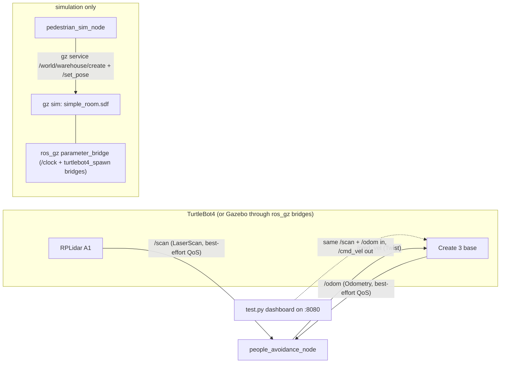

# TurtleBot4 People Avoidance

Real-time, people-aware navigation for the TurtleBot4. A 2D LiDAR scan goes in
and safe velocity commands come out: the robot finds people in raw laser
returns, tracks them with a multi-target Kalman filter, and steers around them
through a Control Barrier Function that holds a hard safety guarantee even when
someone walks straight at it.

Everything runs on the physical robot at scan rate (~7.7 Hz on an RPLidar A1),
and a browser dashboard lets you watch and tune the whole pipeline live.


## Pipeline

```
/scan  (LaserScan · RPLidar A1)
   │
   ▼  leg_detection.py    detect people in the scan
   │  List[LegMeasurement]   { x, y, R }
   │
   ▼  tracking.py         track them over time
   │  List[Track]            { [x, y, vx, vy], P }
   │
   ▼  controller.py       choose a safe velocity
   │  Twist                  { linear.x, angular.z }
   ▼
/cmd_vel  →  TurtleBot4 moves
```

## Node and topic graph

As wired by `people_avoidance.launch.py` and `simulation.launch.py`:



`pedestrian_sim_node` spawns each pedestrian as a two-cylinder leg pair (0.10 m
radius, hip-width apart) and drives them on a bounded random walk with
`gz service` pose calls, so the LiDAR sees the same two-blob pattern as real
legs.

## How it works

### 1. Detection: `leg_detection.py`

Segments the scan with an adaptive jump-distance threshold,
`τ(r) = r·Δθ + k·σ_r`, that grows with range instead of using a fixed gap. Each
cluster is classified by its PCA shape (width and circularity), so walls and long
flat surfaces drop out while round, leg-sized blobs stay. Legs are paired into a
single person position, and the range/bearing sensor noise is propagated through
the full polar→Cartesian Jacobian to give every detection a proper 2×2
covariance for the filter.

### 2. Tracking: `tracking.py`

One constant-velocity Kalman filter per person, using the exact discretized
white-noise-acceleration process noise (with the `dt³/3` and `dt²/2` coupling
terms rather than a diagonal approximation). Measurements are matched to tracks
by Mahalanobis distance, gated at the χ² 99% quantile and assigned jointly with
the Hungarian algorithm. Tracks earn confirmation after several consecutive
hits, duplicates are merged, stationary objects such as furniture and posts are
flagged and ignored, and a predict-ahead step forecasts where each person will
be a second or two from now.

### 3. Avoidance: `controller.py`

A Control Barrier Function solves a small quadratic program: it takes any
desired velocity and returns the closest one that cannot collide, with a
constraint per tracked person and the safety radius inflated by that track's
positional uncertainty. Around the CBF sit Follow-the-Gap heading selection,
goal-directed navigation, a back-off reflex for someone stepping right in front,
and a manual drive mode that still passes through the safety filter, so the
robot cannot be driven into a person by hand.

`people_avoidance_node.py` connects the three stages to ROS 2 topics and handles
the hardware quirks: the RPLidar A1 is mounted rotated 90° on the TurtleBot4,
and its sensor topics use BEST_EFFORT QoS.

## Parameters

Values set in `people_avoidance.launch.py` (node defaults in
`people_avoidance_node.py` differ where noted):

| Parameter | Launch value | Meaning |
|---|---|---|
| `scan_topic` | `/scan` | LaserScan input |
| `cmd_vel_topic` | `/cmd_vel` | Twist output |
| `odom_topic` | `/odom` | Odometry input |
| `laser_frame` / `odom_frame` | `rplidar_link` / `odom` | TF frames |
| `dt` | 0.13 s | Filter step; matches the A1's ~7.7 Hz scan rate (default 0.1) |
| `max_misses` | 5 | Frames without a match before a track is deleted |
| `distance_threshold` | 0.13 m | Segmentation jump-distance base (default 0.1) |
| `leg_radius` | 0.06 m | Expected single-leg radius (default 0.10) |
| `max_leg_width` | 0.65 m | Max separation when pairing legs (default 0.25) |
| `laser_yaw_offset` | 1.5708 rad | Lidar mount yaw; +90 deg on this TB4 (default 0.0) |
| `max_linear_speed` | 0.2 m/s | Speed cap |
| `max_angular_speed` | 1.0 rad/s | Turn-rate cap |
| `obstacle_radius_scale` | 2.0 | Safety-radius inflation per track uncertainty |

`simulation.launch.py` adds `model` (`standard`/`lite`), `num_people` (2),
`ped_speed` (0.5 m/s), and `boundary_radius` (3.5 m); the pedestrian node also
takes `turn_noise_std` (0.4 rad) and `update_hz` (5.0).

## Live dashboard

`test.py` runs the whole pipeline on every scan and serves a control panel at
<http://localhost:8080>:

- a 3D scene of scan clusters, detections, Kalman tracks with ID labels and
  trails, prediction ghosts, safety bubbles, the lookahead probe, and the
  planned path
- a 2D minimap you can click to set a navigation goal
- a live slider for every parameter in the pipeline
- keyboard manual drive, still filtered by the CBF

Plotly is vendored alongside the script, so the dashboard works with no internet
connection.

## Repository layout

```
src/
├── people_avoidance/           the pipeline (ROS 2 package)
│   └── people_avoidance/
│       ├── leg_detection.py    Stage 1: detection
│       ├── tracking.py         Stage 2: Kalman tracking
│       ├── controller.py       Stage 3: CBF avoidance
│       └── people_avoidance_node.py   ROS wiring
└── pedestrian_sim/             Gazebo pedestrian simulator
test.py                         live web dashboard
slalom_mission.py               scripted slalom demo
notebooks/                      multi-target tracking notebooks
```

## Quick start

Build (ROS 2 Jazzy on Ubuntu 24.04, or Humble on 22.04):

```bash
git clone https://github.com/hsn07pk/turtlebot4-people-avoidance.git ros2_ws
cd ros2_ws
colcon build --symlink-install
source install/setup.bash        # or setup.zsh
```

Run on the robot:

```bash
ros2 launch people_avoidance people_avoidance.launch.py
```

Run in simulation, with no robot attached:

```bash
ros2 launch pedestrian_sim simulation.launch.py           # terminal 1
ros2 launch people_avoidance people_avoidance.launch.py   # terminal 2
```

Open the dashboard, with the robot or simulator publishing `/scan`:

```bash
python3 test.py                  # then open http://localhost:8080
```

The full setup, including the ROS 2 install and the robot connection, is in
[SETUP.md](SETUP.md).

## Documentation

| Document | What it covers |
|----------|----------------|
| [SETUP.md](SETUP.md) | Install ROS 2, clone, and build the workspace |
| [TURTLEBOT4_GUIDE.md](TURTLEBOT4_GUIDE.md) | The robot platform: driving, SLAM, Nav2, rosbag |
| [DEVELOPMENT_GUIDE.md](DEVELOPMENT_GUIDE.md) | The algorithms: data contract and equations |
| [REAL_ROBOT.md](REAL_ROBOT.md) | Running on the TurtleBot4, tuning, and safety |
| [SIMULATION.md](SIMULATION.md) | Running offline in Gazebo |
| [DOCKER.md](DOCKER.md) | Running everything inside Docker |

## Built with

ROS 2 (Jazzy / Humble) · Python · NumPy · SciPy · Plotly · RPLidar A1 ·
TurtleBot4 (iRobot Create 3)

## Acknowledgments

This started from the people-detection teaching package for UbiSS 2026 at Aalto
University, and grew into the detection, tracking, and avoidance system here.

## License

Apache License 2.0. See [LICENSE](LICENSE).
